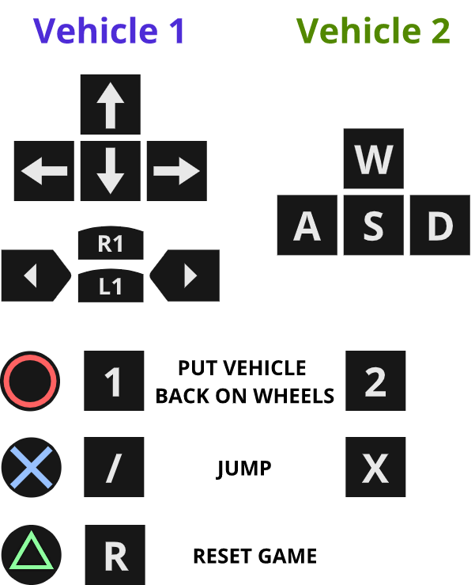
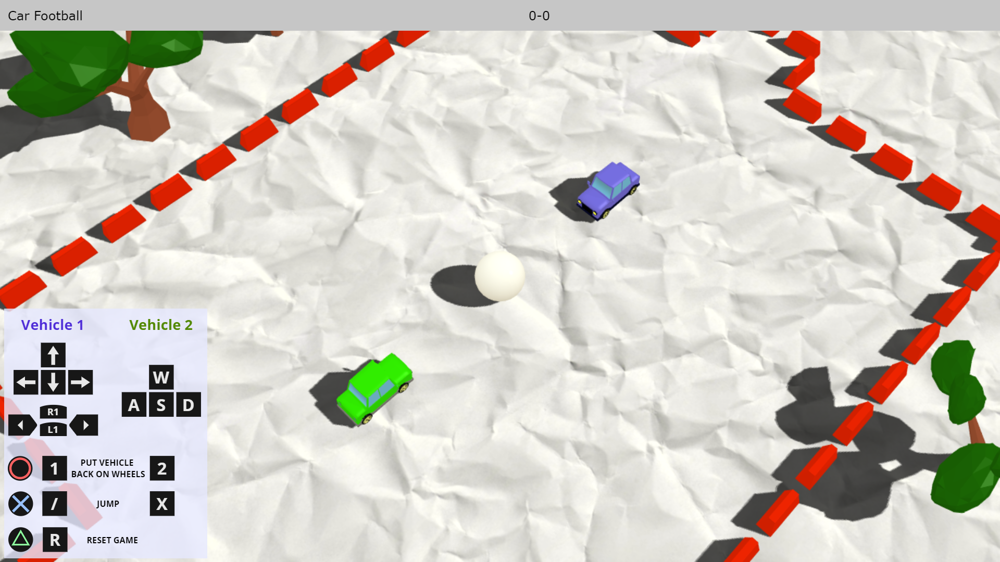
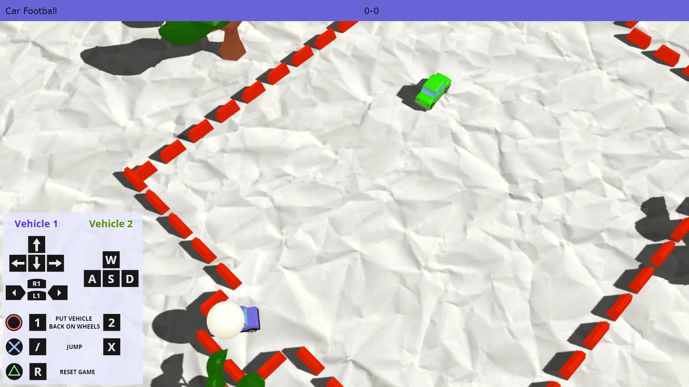

# WebGL Car Football Game

## Opis projektu

W ramach projektu zrealizowaliśmy w technologii WebGL dwuosobową grę przeglądarkową, w której gracze, sterując zabawkowymi samochodami, próbują trafić piłką do bramki przeciwnika.

Inspiracją dla projektu była gra Rocket League, która, choć znacznie bardziej zaawansowana, opiera się na podobnej koncepcji rozgrywki.

Gracze mają możliwość pełnego sterowania samochodem za pomocą klawiatury lub kontrolera do gier (testowany na DualShock 3).

Aby gra była ciekawsza, samochody mają możliwości podskoku, a gracze mogą ustawić pojazdy z powrotem na kółkach, jeżeli samochód się przewróci. Pełna instrukcja sterowania znajduje się w lewym dolnym rogu ekranu.

Po trafieniu piłką do bramki przeciwnika, stan punktowy meczu ulega zmianie, a punkty są wyświetlane na tablicy wyników w górnej części strony.

## Link do strony z projektem

[Strona z grą](https://def-au1t.github.io/car-football/)

## Opis techniczny

Kod skryptu odpowiedzialnego za generowanie planszy znajduje się w pliku `js/script.js`.

### Obiekty 3D

W projekcie użyliśmy modeli w formacie `.json` ładowanych przez bibliotekę three.js. Zostały one wygenerowane przy pomocy programu Blender i wyeksportowane w taki, sposób, aby możliwy był ich poprawny odczyt z pliku tekstowego.

Z racji ograniczonych możliwości sprzętowych, skorzystaliśmy z trójwymiarowych modeli low-poly drzew, aby rozgrywka była możliwie płynna. Elementy stanowiące granicę boiska zostały przez nas stworzone ręcznie w Blenderze.

Uznaliśmy, że dodanie tekstury papieru na podłoże sprawi, że w połączeniu z zaimportowanymi modelami zabawkowych samochodów, gra będzie miała - popularny obecnie - rysunkowy charakter.

### Kamera

Zastosowaliśmy kamerę perspektywiczną (`PerspectiveCamera`), która podąża za punktem pomiędzy dwoma graczami, a jej odległość zmienia się w taki sposób, żeby pokazać obu graczy.

### Światło

W programie zostały użyte dwa źródła światła:

- `HemisphereLight` - odpowiada za ogólną jasność całej sceny
- `DirectionalLight` - dodaje cienie i mocniejsze oświetlenie od strony "słońca"

### Fizyka

Elementy fizycznie są obliczane na dwa sposoby:
- `ConvexMesh` - samochody - jest to dość obciążające obliczeniowo
- `BoxMesh/SphereMesh` - mniejsza (lecz wystarczająca) dokładność piłki i ograniczników planszy

### Użyte technologie i biblioteki

- Biblioteki Three.js & Physi.js
- Modele wyeksportowane za pomocą programu Blender
- Biblioteka GameController do obsługi sterowania kontrolerem przez przeglądarkowe Gamepad API.
- Modele drzew: https://blendswap.com/blend/19242
- Modele samochodów: https://free3d.com/3d-model/low-poly-car--49763.html
- Modele zderzaków stworzone samodzielnie w programie Blender

### Tryb debugowania

Po otwarciu strony z parametrem `?debug` w adresie dostępne są statystyki wyświetlania klatek na sekundę, oraz panel z ustawieniami fizyki, które można zmieniać w czasie gry.

[Strona z grą - tryb debugowania (z parametrami i licznikiem FPS)](https://def-au1t.github.io/car-football/?debug)

## Sterowanie w grze

Gracz 1 może użyć pada zamiast klawiatury. Przedstawiono obrazki klawiszy odpowiednie dla padów DualShock (PlayStation).

## Zrzuty ekranu

### Ekran rozgrywki

### Zdobycie punktu sygnalizowane zmianą koloru belki

## Film z rozgrywki
[Nagranie z rozgrywki](https://aghedupl-my.sharepoint.com/:v:/g/personal/jaceknit_student_agh_edu_pl/EZ0lBYfSDKlPitFgiweSHDgBmz_ZQxFiYwwNoG-dRcNzVw?e=l1YkIb)

## Autorzy:

- Karol Musur
- Jacek Nitychoruk
