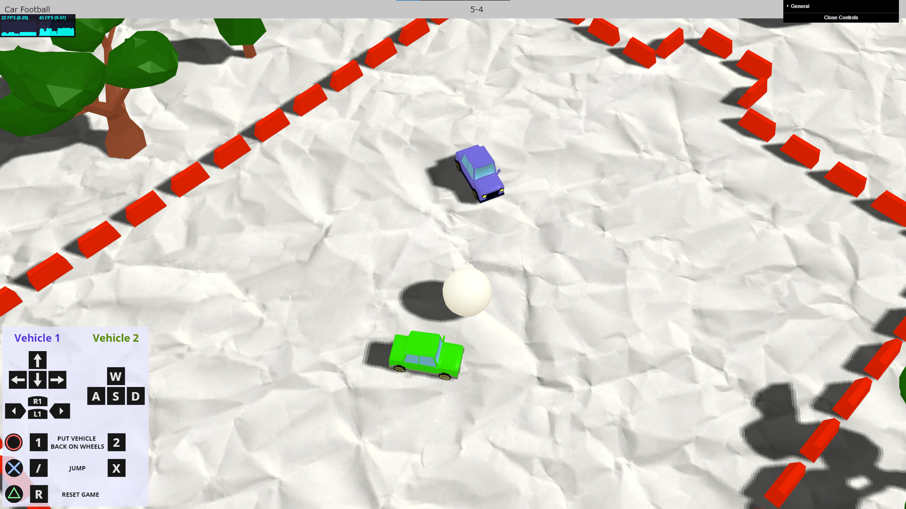

# Car Football Game

## Opis gry

W ramach projektu zrealizowaliśmy dwuosobową grę przeglądarkową, w ramach której gracze sterując samochodami próbują trafić piłką do bramki przeciwnika.

Gracze mają możliwość pełnego sterowania samochodem za pomocą klawiatury lub kontrolera do gier.

Aby gra była ciekawsza, samochody mają możliwości podskoku, a gracze mogą ustawić pojazdy z powrotem na kółkach, jeżeli samochód przewróci się.

Po trafieniu piłką do bramki przeciwnika, stan punktowy meczu ulega zmianie.

## Użyte technologie

- Biblioteki Three.js & Physi.js
- Modele wygenerowane za pomocą programu Blender

## Zrzuty ekranu

## Autorzy:

- Karol Musur
- Jacek Nitychoruk

